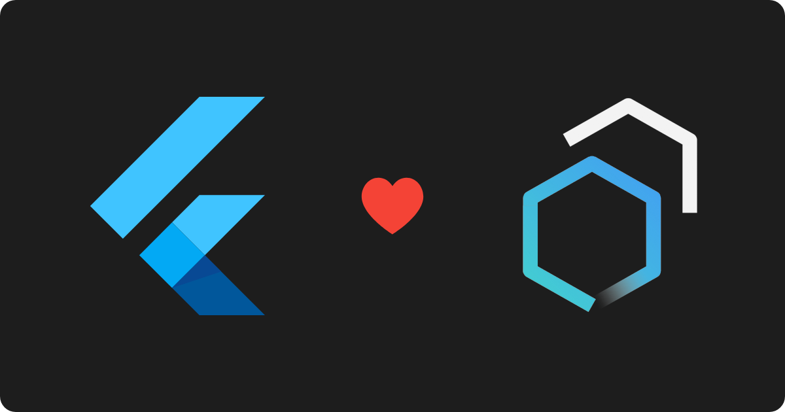
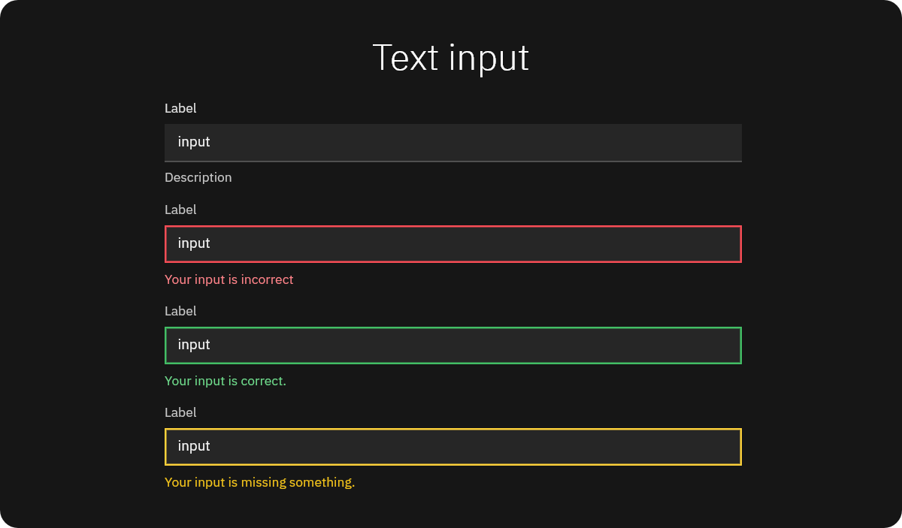
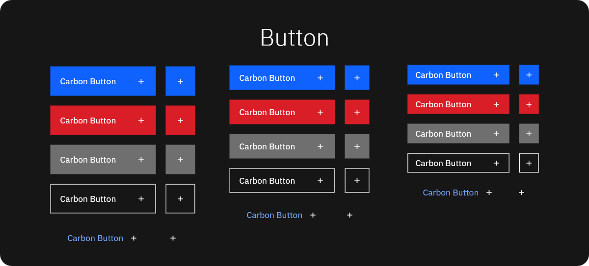
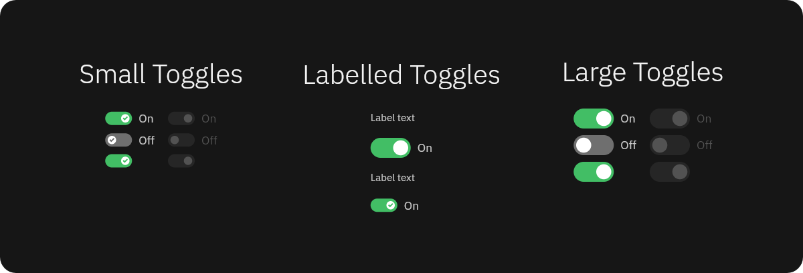

# Flutter Carbon



‌Carbon is IBM’s **open-source** design system for products and experiences. With the IBM Design Language as its foundation, the system consists of working code, design tools and resources, human interface guidelines, and a vibrant community of contributors.

‌
The goals of the design system include improving UI consistency and quality, making the design and development process more efficient and focused, establishing a shared vocabulary between designer and developer, and providing clear, discoverable guidance around design and development best practices.

### Carbon Flutter 💎

**Flutter Carbon** is an unofficial implementation of Carbon Design System using Flutter framework. It provides Flutter developers a collection of widgets to build apps and user interfaces. Adopting the package enables developers to use consistent styles and behavior in prototype and production work.

> ⚠️ **WARNING:** The project is still under development and not ready for production.

### Finished widgets

- [x] CButtons (primary, secondary, danger, tertiary, ghost)

- [x] CTextfield (primary, success , warning, danger) based on validation

- [x] CForm (form , form group)

- [x] CCheckbox

- [x] CIcon and CIcons which contains all carbon icons

- [x] CSVGIcon

- [x] CLink

- [x] Breadcrumb

- [x] Toggle

- [x] Notification

- [x] Tile

# Screenshots

### Textfield



### Form


### Button



### Toggle



### Notification


# Installation

1. Clone the repo, in the same directory of your project. Example:

```
carbon --> (the cloned repo)
your_project
```

2. Import the repo (package) locally into your project:

```
dependencies:
  carbon:
    path: ../carbon
```

3. Everytime there is an update, all you need is to pull it

# Guidelines 

### Architecture 🗃️

#### Feature-based architecture

Feature is an essential concept to understand any software design. It’s also used to describe the requirements for software development. Therefore, if the project is structured by features, it will be easier to manage the project when it grows as we construct bigger units.

##### Organize project by features

In complex software, it’s hard to understand how different modules collaborate. A feature-oriented architecture is helpful for this because if related `(widgets|utils|models|styles| ..etc)` grouped into features, no need to think about how the small parts work together but how features work together to construct the software.

### **Conventions** ✅

#### Naming files: snake case

snake_case is a naming style where **all letters in the name are lowercase** **and** **it uses** ***underscores*** **to separate words** in a name. In addition, in **Angular**, a dot is used to separate the name, type, and extension for file names. `file_name.type.dart`

Including the type in the file names make it easy to find a specific file type using a text editor or an IDE.

Most common files types are: .widget, .style, .service, .model, .util, .store

> Create additional type names if you must but take care not to create too many.

**Examples**

- `file_name.widget.dart`
- `file_name.style.dart`
- `file_name.model.dart`
- `file_name.util.dart`

### **Styling** 🎨

In Flutter, we often make files for colors, strings, text styles, themes. This way all of these values are kept in one, easy to find a place that should make life easier for the person who gets stuck with maintaining the app.

### Styling as a feature

App-wide colors, fonts, themes, and animations should be grouped into a feature called `styles`. This approach will make all the widgets in the application consume the styles from a single source.

**Example:**

`colors.style.dart`

```dart
    abstract class CColors {
      static const white0 = Color(0xffffffff);
      static const black100 = Color(0xff000000);
      static const blue10 = Color(0xffedf5ff);
      static const blue20 = Color(0xffd0e2ff);
      static const blue30 = Color(0xffa6c8ff);
    }
```

`text.style.dart`

```dart
    abstract class CFonts {
      static const primaryRegular = 'IBMPlexSans-Regular';
      static const primaryLight = 'IBMPlexSans-Light';
      static const primaryMedium = 'IBMPlexSans-Medium';
      static const primarySemibold = 'IBMPlexSans-SemiBold';
      static const primaryBold = 'IBMPlexSans-Bold';
    }
```

### Widgets styling

If the widget is complex and has reactive behavior based on specific actions (e.g., the background color changes when the button is tapped). In that case, we need to separate the widget colors and layout variables from the widget code.

Example: [`notification.style.dart`](https://github.com/NourEldinShobier/carbon-flutter/blob/master/lib/features/notification/notification.style.dart) and [`notification.widget.dart`](https://github.com/NourEldinShobier/carbon-flutter/blob/master/lib/features/notification/notification.widget.dart)

#### How to setup the widget styles

`name-type-state-status-...secodary_attrs...-target_property`

Example (1): notification

- `name`: notification
- `type`: inline or toast
- `state`: enabled, disabled, focused, … etc.
- `secodary_attrs`: low contrast / high contrast
- `target_property`: background color

Example (2): toggle

- `name`: toggle
- `state`: enabled, disabled, focused, … etc.
- `status`: checked / unchecked
- `target_property`: background color
